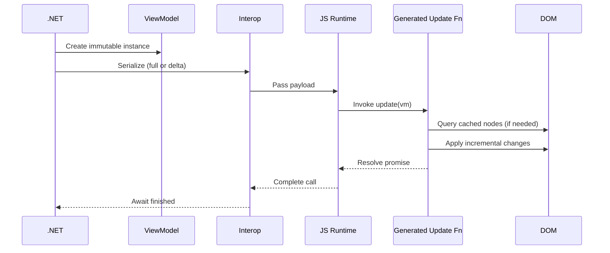
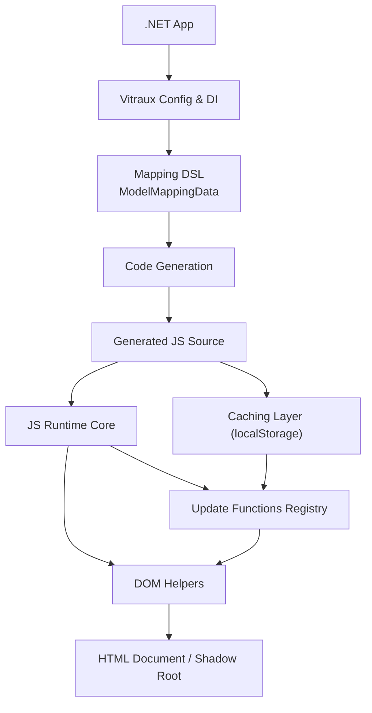
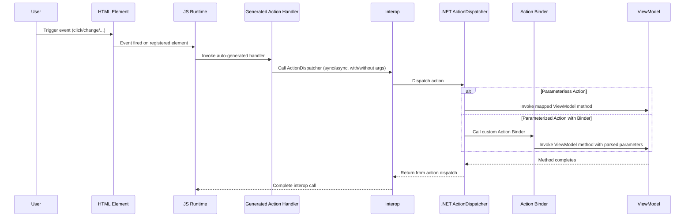
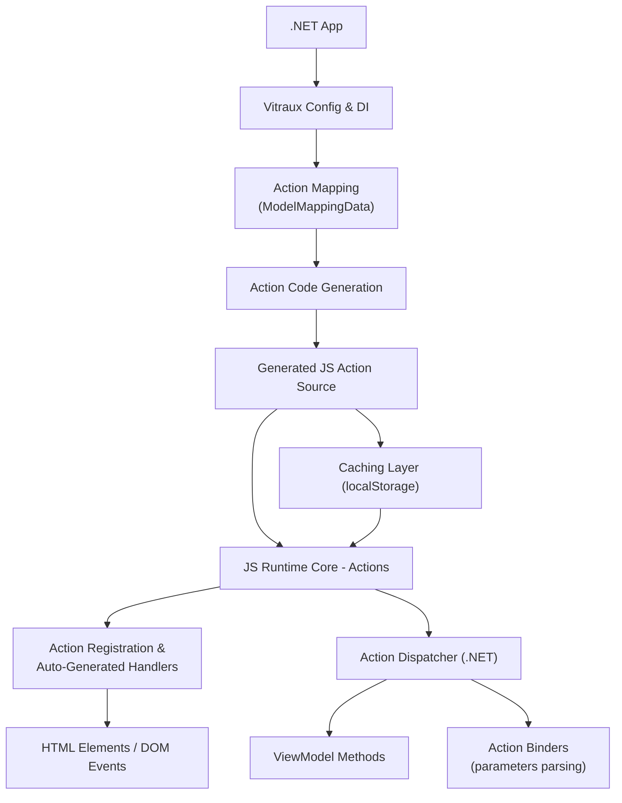

# Vitraux Architecture

Authoritative overview of how Vitraux maps immutable .NET ViewModels to efficient, incremental DOM updates and event handling in WebAssembly without adopting a component model.

## 1. Goals (Recap)
- Keep HTML standard and author-driven (templates, fragments, plain markup).
- Decouple backend (C# ViewModels + mappings) from frontend structure.
- Generate minimal JavaScript that applies only necessary DOM mutations and event handling.
- Support Shadow DOM (optional).
- Remain trimmable / AOT-friendly in Release builds.
- Provide predictable performance (no virtual DOM diff layer).

## 2. High-Level Flow

1. Model configuration is registered in DI (IViewModelConfiguration\<T\>).
2. At Vitraux build time:
   - Each configuration produces a ModelMappingData (declarative graph).
   - Mapping graph is converted into Initialization JS + Update JS source strings.
   - Actions in the mapping graph are converted into Event Handling JS source strings.
3. On first usage in the browser:
   - Optional: attempt to load cached functions (if version-based caching enabled).
   - If not cached or version mismatch: new functions are generated and stored.
4. Runtime update:
   - .NET code calls IViewUpdater\<T\>.Update(viewModel) for a new viewmodel instance or IViewUpdater\<T\>.Update() for a registered singleton viewmodel.
   - ViewModel serialized (only changed data if tracking enabled) and passed to JS.
   - JS update function applies incremental DOM mutations.
   - User events on registered HTML elements trigger the auto-generated event handler functions, which in turn invoke one of .NET’s ActionDispatcher methods, ultimately calling the corresponding ViewModel method.

## 3. Layers

| Layer | Responsibility |
|-------|----------------|
| Configuration / DI | Register model configurations, global Vitraux options, strategies. |
| Mapping DSL | Fluent API producing ModelMappingData (values, collections, actions, templates). |
| Code Generation | Emit three JS blocks per ViewModel: initialization + update for DOM manipulation, and action's event handling. |
| Caching & Versioning | LocalStorage-based reuse keyed by (VM key + version). |
| Runtime Bridge | JS interop glue: invokes generated initialization code, holds update delegates and add event listeners. |
| DOM Operations and Event Handling| Fine-grained mutation helpers (content, HTML, attributes, insertion) and event listener adding. |

## 4. Core Abstractions (C# Side)

- IViewModelConfiguration\<T\>: Declares mapping & behavior (QueryElementStrategy, TrackChanges, caching).
- IViewModelMapper\<T\>: Fluent mapping builder (MapValue, MapCollection, MapAction, ToElements, ToTables, FromInputs, etc.).
- ModelMappingData: Immutable result consumed by code generation.
- ConfigurationBehavior: Behavioral flags + strategies (QES, caching, change tracking).
- IViewUpdater\<T\>: Entry point to trigger an update of the bound HTML.

## 5. Mapping Concepts

| Concept | Description |
|---------|-------------|
| Value Mapping | Single property bound to one/many elements (content, html, attribute). |
| Collection Mapping | Repeated region bound via templates or URI (table rows, fragments). |
| Action Mapping | Binds HTML events to ViewModel methods. |
| Template Source | Inline \<template\> or externally loaded fragment (cached). |
| Query Element Strategy (QES) | Controls how elements are resolved and reused (e.g., OnlyOnceAtStart). |
| Change Tracking | Optionally transmits only changed field values across interop boundary. |
| Auto-generated Function Caching | Controls whether the JS auto-generated functions are regenerated on each load or reused. |
| Action Registration Strategy | Controls when the JS auto-generated event handling registration must to execute (e.g., OnlyOnceOnFirstViewModelRendering). |

## 6. JavaScript Generation Model

Three generated code segments per ViewModel:

1. Initialization Code:
   - Queries and caches DOM references per mapping entry (depending on QES).
   - Prepares template cloning helpers.
   - Registers the async update function via createUpdateViewFunction.

2. Update Code:
   - Receives serialized ViewModel data.
   - Applies conditional mutations for each mapping:
     - Skip if unchanged (when change tracking enabled).
     - Efficient loops for collections (add, reuse, remove).
   - Invokes DOM helpers (text, html, attributes, structural insertions).
3. Event Handling Code:
   - Generates the JavaScript needed to register event handlers for mapped Actions.
   - Handlers optionally gather parameters from the DOM and invoke the .NET ActionDispatcher.
   - Can be cached and reused across sessions when version-based caching is enabled.

The runtime wraps update code with:
```javascript
return (async () => { <generated update body> })()
```
stored as a Function("vm", allCode) bound to an internal vms dictionary keyed by VM identifier.

## 7. Caching & Version Strategy

- Storage Medium: localStorage.
- Stored Objects:
   - For View Updates:
   {
      initializationCode: "...",
      updateViewCode: "...",
      version: "x.y..."
   }
      - Retrieval Path:
         - tryInitializeViewFunctionsFromCacheByVersion → executes cached initialization → reconstructs update function.
         - On miss or mismatch → initialization + update code executed & stored with new version.
   - For Event Handling:
   {
   actionsCode: "...",
   actionRegistrationStrategy: actionRegistrationStrategy...,
   version: "a.b..."
   }
      - Retrieval Path:
         - tryInitializeActionsFunctionFromCacheByVersion → executes cached event handling initialization.
         - On miss or mismatch → event handling initialization code executed & stored with new version.
- Future Extension (planned): cryptographic or content hashing scheme for schema evolution.

## 8. DOM Helper Responsibilities (Excerpt)

| Helper | Function |
|--------|----------|
| setElementsContent | Update textContent. |
| setElementsHtml | Set innerHTML (only for trusted content). |
| setElementsAttribute | Attribute assignment or boolean toggle. |
| updateValueByInsertingElements | Responsible for templated row/fragment materialization. |
| (Collection ops) | Clone template nodes, insert, prune removed items (implementation-specific). |
| registerActionAsync y others | Register events in different combinations: Sync/Async/Parameterless/Parametrizable .
| addActionListenerToElements | Add event listeners to elements.
DOM operations intentionally avoid frameworks and stay allocation-light.

## 9. Performance Characteristics

- Use of plain loops over LINQ for hot paths.
- Node caching reduces querySelector cost under QES=OnlyOnceAtStart.
- Collection operations designed to minimize DOM churn (reuse nodes when consistent ordering).
- Version caching eliminates regeneration overhead on reload.
- Minimizes cross-interop payload size with change tracking.
- Action registration strategy reduces cost under OnlyOnceAtStart.

## 10. Shadow DOM Support

- Optional useShadowDom configuration:
  - Affects root query context (e.g., host.shadowRoot vs document).
  - Element resolution logic branches based on host strategy.
  - Generated initialization guards for presence/absence of Shadow DOM.

## 11. Security Considerations

| Aspect | Rule |
|--------|-----|
| HTML Injection | Only via explicit .ToHtml mappings (trusted only). |
| Execution | No eval / dynamic code except controlled Function wrapper for generated update (internal). |
| Sandboxing | No global prototype modifications. |
| Data Flow | Immutable ViewModel objects reduce mutation ambiguity. |

## 12. Trimming & AOT

- Release build sets: IsTrimmable=True, IsAotCompatible=True.
- Reflection avoided in update path (only allowed in bootstrap / mapping discovery if required).
- Public API intentionally minimal to reduce root retention.

## 13. Update Lifecycle (Detailed)

1. (Optional) Initialization executed at load or first update:
   - Query + cache DOM.
   - Register JS update function.
2. .NET: Serialize ViewModel (full or delta).
3. JS: Invoke update function passing vm payload.
4. Update function:
   - For each mapped value: compare & mutate.
   - For collections: compute required structural ops (add, reuse, drop).
   - Apply attributes/content/HTML.
5. Return control to .NET (async boundary).

## 14. Action Lifecycle (Detailed)

1. At build time, Vitraux generates the JavaScript required to register event handlers for all mapped Actions.
2. At startup (or on first rendering, depending on configuration), these handlers are attached to the corresponding HTML elements.
3. When a user event occurs, the associated auto-generated handler is executed.
4. If the Action requires parameters, the handler collects them from inputs or DOM queries using the generated parameter-gathering logic.
5. The handler invokes the appropriate .NET ActionDispatcher method (sync or async, with or without parameters), passing along any gathered arguments.
6. For parameterized Actions, the user must provide a custom action binder in .NET: a class derived from ActionParametersBinderBase (or its async counterpart) to parse the JS-provided parameters before invoking the ViewModel method.
7. Depending on whether the Action is parameterized, the ActionDispatcher either calls the mapped ViewModel method directly or delegates parameter processing to the custom action binder.
8. If the ViewModel method updates application state, the developer may trigger a subsequent UI update by invoking the appropriate IViewUpdater<T>.Update.
9. The process completes when the dispatched .NET method finishes execution and any awaited operations resolve.

## 15. Error Handling

- JS internal errors (e.g., missing element) should throw explicit VitrauxInternalError (future centralization recommended).
- Fail-fast on misconfiguration (null vmKey, missing version).
- Future: introduce pluggable logger (globalThis.vitraux.log).

## 16. Extensibility Points

| Extension | Mechanism |
|-----------|-----------|
| New QES | Implement & register strategy in configuration behavior. |
| Custom Value Transform | Hook in mapping builder (future pipe concept). |
| Collection Diff Policy | Replace internal algorithm for advanced heuristics. |
| Caching Strategy | Add alternative (hash-based, per-session). |

## 17. Sequence (View Update Path)


## 18. Component Diagram (View Update)


## 19. Sequence (Action Path)


## 20. Component Diagram (Actions)


## 21. Design Constraints
- No Razor lifecycle.
- No virtual DOM diff.
- Deterministic generation order,
- No leakage of internal temp identifiers.
- No framework/library coupling.

## 22. Risks & Mitigations
- DOM drift (init validation).
- Large collection jank (batching/windowing).
- Stale cache (version discipline).
- Unsafe HTML overuse (document trust boundaries).

## 23. Contribution Impact Checklist
- Update this doc.
- Add tests (cold start, cached path, Shadow DOM).
- Eeassess performance.
- Validate trimming/AOT.
- Bump version/generator if schema shifts.
- Update reference manual.

## 24. Quality Guardrails
- Warnings as errors.
- Cohesive generator functions.
- Deterministic emission ordering.
- Avoid broad reflection.
- Favor pure functions when possible.
- Favor inmutable record class data objects when possible.

## 25. Glossary
- ViewModel Key (mapping identity).
- Initialization Function (element/template resolution).
- Update Function (incremental DOM changes).
- Action Registration (event handling)
- QES (element retrieval policy).
- Delta Payload (changed fields only).
- Version Caching (reuse until version changes).

## 26. Canonical Status
This document is authoritative; must stay aligned with README and reference manual. Changes require intentional review.
